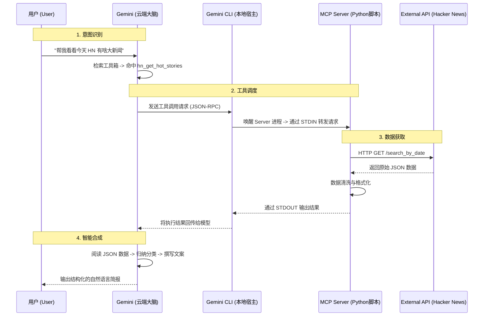

# How MCP Works: 从 Prompt 到 API 的全链路解析

本文档基于一个真实的 Hacker News 新闻简报案例，详细解析 **Model Context Protocol (MCP)** 的工作流程。

---

## 核心流程图解

MCP 的工作流可以概括为四个阶段：**意图识别 -> 工具调度 -> 数据获取 -> 智能合成**。



---

## 详细步骤拆解

### 第一阶段：意图识别 (Intent Recognition)
1.  **用户输入**：用户发出自然语言指令（例如：“调用 `hn_get_hot_stories` 获取新闻”）。
2.  **上下文检索**：模型检查当前配置的 `mcpServers`。在这个案例中，它发现了 `week3-toolkit` 提供的 `hn_get_hot_stories` 工具。
3.  **决策**：模型判断用户的需求无法仅靠内部知识回答，必须调用外部工具，因此决定发起函数调用。

### 第二阶段：工具调度 (Tool Dispatching)
这是 MCP 协议的核心。模型不直接运行代码，而是生成一个描述“我想做什么”的 JSON 对象。

*   **JSON-RPC 请求**：
    ```json
    {
      "jsonrpc": "2.0",
      "method": "tools/call",
      "params": {
        "name": "hn_get_hot_stories",
        "arguments": { "hours": 24, "limit": 20 }
      },
      "id": 1
    }
    ```
*   **宿主中转**：Gemini CLI（作为 MCP Client）接收到这个请求，找到对应的 Server 进程（`python -m week3.server.main`），并通过标准输入 (STDIN) 将请求传给它。

### 第三阶段：数据获取 (Data Execution)
此时，控制权交给了开发者编写的 Python 代码。

1.  **路由**：`FastMCP` 框架接收请求，根据 `name` 找到对应的 Python 函数。
2.  **执行**：执行 `week3/server/tools/hn.py` 中的逻辑。
    *   计算时间戳。
    *   通过 `httpx` 向 Algolia API 发起真实的 HTTP 请求。
3.  **响应**：API 返回数据后，Python 代码将其处理为字符串，并通过标准输出 (STDOUT) 打印出来。
4.  **回传**：Gemini CLI 捕获这些输出，将其包装成 MCP 响应消息，发回给云端的模型。

### 第四阶段：智能合成 (Intelligent Synthesis)
模型收到了工具返回的原始数据（通常是 JSON 格式）。

1.  **阅读理解**：模型像阅读文章一样阅读这段 JSON 数据。
2.  **加工处理**：
    *   **聚类**：将 "Nvidia" 和 "Chip" 相关的文章归为一类。
    *   **摘要**：提取 "Ruby 4.0.0 Released" 这样的关键信息。
3.  **生成回复**：模型根据处理后的信息，生成最终呈现给用户的 Markdown 格式简报。

---

## 总结
MCP 充当了 **AI 大脑** 和 **本地代码/外部世界** 之间的通用桥梁。
*   **AI** 负责“思考”和“处理信息”。
*   **MCP Server** 负责“执行动作”和“提供数据”。
*   **Gemini CLI** 是连接两者的管道。
